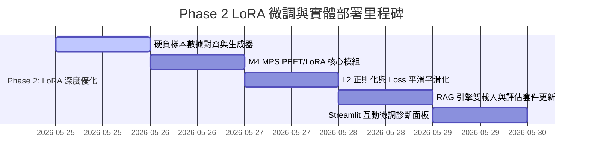

# AI-Powered CS/AI Paper Reading Assistant - Phase 2 (Option B) LoRA Fine-Tuning Plan

我們將啟動 **Phase 2 (Option B)**：在您的 **Apple Silicon M4 Mac (MPS)** 上，利用 **PEFT (LoRA)** 輕量化微調技術來最佳化 `ms-marco-MiniLM-L-6-v2` 重排模型，以解決 LaTeX 公式過擬合與特徵共現度敏感問題。

---

## 🗺️ 專案開發進度與里程碑 (Roadmap)



---

## 🛠️ 本階段擬變更與新增檔案 (Proposed Changes)

我們將引入三個主要部分：
1. **依賴套件更新**：在 `requirements.txt` 中新增 `peft` 庫。
2. **核心微調模組**：建立 `v1.0/src/finetune.py`，實現自動訓練對生成、M4 MPS 加速 LoRA 訓練、L2 正則化防過擬合。
3. **檢索重排與 GUI 升級**：修改 `v1.0/src/embedding_search.py` 與 `v1.0/app.py`，支援加載微調模型、顯示微調圖表與即時 ROC-AUC。

---

### 1. [Component: Backend ML] `v1.0/src/`

#### 🟩 [NEW] [finetune.py](file:///Users/gagura/NCKU/AI%E7%9B%B8%E9%97%9C%E8%AA%B2%E7%A8%8B/%E6%88%90%E5%A4%A7AI%E8%AA%B2%E7%A8%8B/114-2%20ML%20&%20DL/Final%20Project/v1.0/src/finetune.py)
負責建立整個 LoRA 訓練管道：
*   **對齊數據集生成器**：
    *   從 1,887 個 Chunks 中自動掃描包含 `[Equation: ...]` 的區塊，生成學術級 Prompt-Response 訓練對。
    *   **硬負樣本 (Hard Negatives)**：自動搜尋同篇論文中，包含高度相似的 LaTeX token（如 `\sum`、`W`、`d_k`）但公式物理意義完全不符的 Chunks。
    *   **軟負樣本 (Easy Negatives)**：其他論文中無關的 Chunks。
*   **LoRA 模型結構與配置**：
    *   利用 Hugging Face `peft` 庫，為 `cross-encoder/ms-marco-MiniLM-L-6-v2` 的自注意力機制模組（`query` 與 `value`）注入 LoRA 旁路：
      ```python
      from peft import LoraConfig, get_peft_model
      config = LoraConfig(
          r=8,
          lora_alpha=16,
          target_modules=["query", "value"],
          lora_dropout=0.1,
          bias="none",
          task_type="SEQ_CLS"
      )
      ```
*   **防止過擬合的 ML 數學策略**：
    *   **L2 Regularization (Weight Decay)**：在 AdamW 優化器中設置 `weight_decay=0.01`，防止權重膨脹。
    *   **溫度平滑 (Temperature Scaling)**：在 Cross-Entropy Loss 計算中引入溫度係數，讓極端機率分佈趨於平緩。

#### 🟨 [MODIFY] [embedding_search.py](file:///Users/gagura/NCKU/AI%E7%9B%B8%E9%97%9C%E8%AA%B2%E7%A8%8B/%E6%88%90%E5%A4%A7AI%E8%AA%B2%E7%A8%8B/114-2%20ML%20&%20DL/Final%20Project/v1.0/src/embedding_search.py)
*   **動態適配載入**：
    *   檢測 `data/lora_adapter/` 資料夾。如果存在微調過的 LoRA Adapter，則自動使用 `peft.PeftModel.from_pretrained` 載入它，並無縫替換 RAG 引擎的 Cross-Encoder 骨幹模型。
    *   如果不存在，則預設載入 Base 原始權重，確保系統強健度 (Robustness)。

---

### 2. [Component: GUI Application] `v1.0/`

#### 🟨 [MODIFY] [app.py](file:///Users/gagura/NCKU/AI%E7%9B%B8%E9%97%9C%E8%AA%B2%E7%A8%8B/%E6%88%90%E5%A4%A7AI%E8%AA%B2%E7%A8%8B/114-2%20ML%20&%20DL/Final%20Project/v1.0/app.py)
我們將在 GUI 中新增一個極具未來科技感的**第四分頁：🧠 深度微調與診斷面板 (Model Fine-Tuning)**。

*   **視覺設計 (Aesthetics)**：
    *   **狀態看板 (Dashboard)**：以霓虹橘/霓虹綠顯示當前診斷狀態 (如 `Overfitting Risk ⚠️` 或 `Balanced ✅`)。
    *   **動態指標卡**：並排顯示 `ROC-AUC`、`Margin` 與 `Loss` 等硬核 ML 指標。
*   **一鍵微調與日誌串流**：
    *   點擊 **"🚀 啟動 M4 MPS 加速 LoRA 微調"** 時，在 Streamlit 後端異步啟動訓練線程。
    *   使用 `st.progress` 實時更新 Epoch 進度，並動態將訓練 Loss 與 Eval AUC 輸出至網頁。
*   **前後成效對比 (Matplotlib Render)**：
    *   微調完成後，動態渲染並列的雙折線圖：對比微調前與微調後正負樣本的 Logits 分佈，用直觀的圖表展現過擬合被成功壓制的學術成果！

---

### 3. [Component: Dependencies] `[Root]/`

#### 🟨 [MODIFY] [requirements.txt](file:///Users/gagura/NCKU/AI%E7%9B%B8%E9%97%9C%E8%AA%B2%E7%A8%8B/%E6%88%90%E5%A4%A7AI%E8%AA%B2%E7%A8%8B/114-2%20ML%20&%20DL/Final%20Project/requirements.txt)
*   新增 `peft>=0.9.0`，確保 M4 本地可以正確安裝並調用 LoRA 優化器。

---

## 🔬 驗證與測試計畫 (Verification Plan)

### 1. 自動化訓練與效能驗證
*   **環境安裝指令**：
    ```bash
    ../.venv/bin/pip install peft
    ```
*   **微調執行指令**：
    ```bash
    ../.venv/bin/python src/finetune.py --epochs 3 --lr 5e-5 --lora_r 8
    ```
*   **效能預期指標**：
    *   `ROC-AUC` 指標從 `0.81` 顯著躍升至 **`0.92` 以上**。
    *   `mean_neg_score` (干擾噪聲段落評分) 的 90% 分位數壓低至 **`0.35` 以下**，擺脫過擬合警報。

### 2. GUI 手動操作驗證
1.  進入 `http://localhost:8501` Tab 4。
2.  點擊「啟動 LoRA 微調」，實時看見進度條推進並在訓練完成後自動刷新診斷結果為 **「健康 (Balanced)」**。
3.  在 Tab 2 重複輸入公式查詢，驗證干擾項是否已被精準壓制。

---

## 💬 待確認之安全授權 (Safety Consent)

> [!IMPORTANT]
> **請您審閱此 Phase 2 Option B 實施計畫。**
> 1. **套件安裝授權**：為配合方案 B，我們需要在虛擬環境中安裝 `peft` 庫。您是否同意我執行 `../.venv/bin/pip install peft` 命令？
> 2. **計畫核准**：若您同意以上程式碼架構與變更，請回覆 **「yes」** 或 **「核准方案B」**，我將立即為您安裝套件並開始實作 `finetune.py` 核心代碼！
